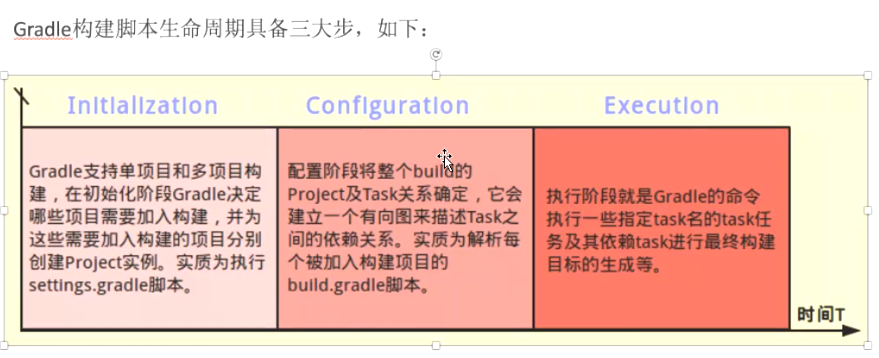
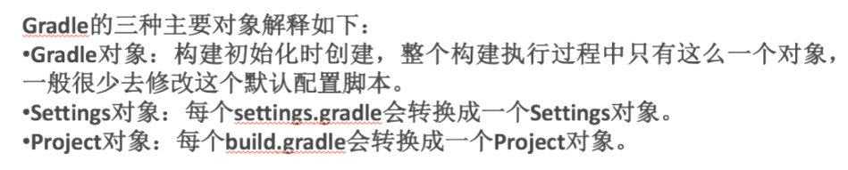
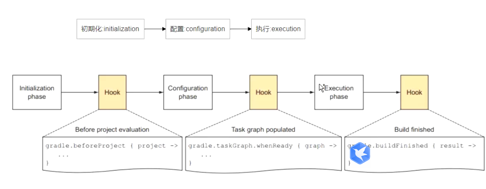

gradle clean

gradle assembleDebug

gradle assembleRelease


build生命周期





gradle的三种对象




构建过程中的hook




groovy语法

```groovy
task clean(type: Delete) {
    delete rootProject.buildDir
}
```

task 任务。type: Delete 清空  

 delete rootProject.buildDir 删除此目录


增加新任务

```groovy
task stringText{
    def str1 = 'nihao'
    def str2 = 'tianzhen'

    println(str1+str2)

    println "${str1} --- ${str2}"
}

//构建后结果  
nihaotianzhen
nihao --- tianzhen

```
